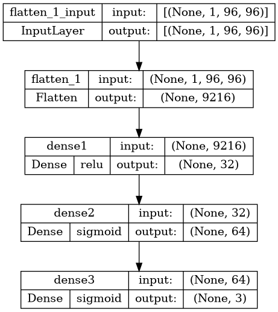
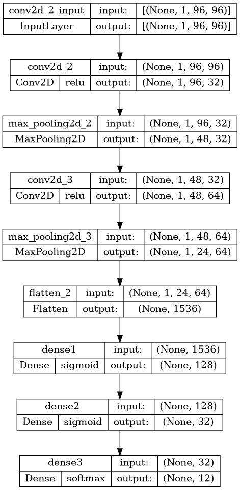
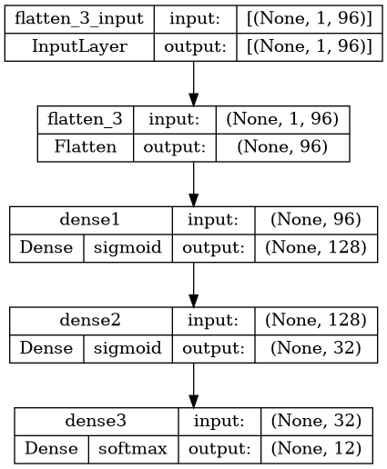
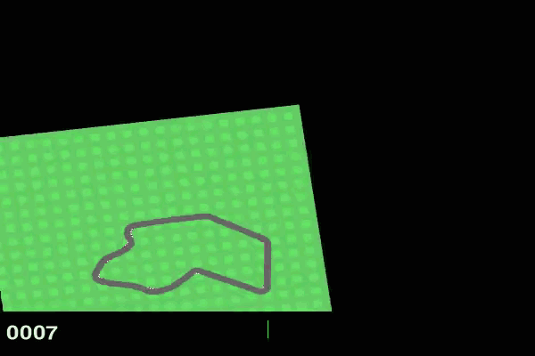
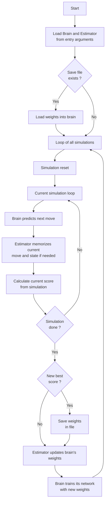

# Car Racing - Reinforcement Learning

# Introduction

During our study year at University of Kent, we had to produce a project in a group of 4 peoples. We decided to work on a Reinforcement Learning project. The goal was to train a car to drive on a track using Reinforcement Learning algorithms. We had to implement the algorithms and the models from scratch. We also had to implement a way to visualize the training and the results of the training.

# Implemented Reinforcement algorithms
| Algorithm | Description | File | Applicability | Implemented ? | Responsible |
| --- | --- | --- | --- | --- | --- |
| Classic Genetic Algorithm |  |Genetic.py |✅ | ✅ | Gabriel |
| Deep Q Neural Network (DQN) |  |DQN.py |✅ | ✅ | Nathan |
| Neat Algorithm |  |NEAT.py  |✅ | ✅ | Tom |
| DDPG Algorithm |  |DDPG.py  |✅ |🔧 | Gabriel |
| PPO Algorithm |  |PPO.py  |✅ | 🚧 | Hugo |
| Actor Critic Method |  |  |✅ |🔴 | Hugo |
| VPG Algorithm |  |  |✅ | 🚧 | Maxime |
| Q-learning or value-iteration methods |  |  |  |🔴 | |
| Q-Learning |  |  |  | 🔴 | |

> 🔴 : Not implemented<br>
> 🚧 : In progress<br>
> ✅ : Implemented

# Implemented models
| Model | Description | File | Implemented ? | Responsible |
| --- | --- | --- | --- | --- |
| CNN | Classic CNN where outputs are the value of simulation parameters |CNN.py |✅ | Nathan |
| Fully Connected | Only Dense layers where outputs are the value of simulation parameters  |FullyConnected.py |✅ | Gabriel |
| Selective CNN | CNN where the outputs are which move done (move predifined) |SelectiveCNN.py |✅ | Nathan |
| Selective Fully Connected + Kmeans | Only Dense layers where the outputs are which move done (move predifined), but the input isn't the image but a single line of majoritary class selected by the Kmeans |SelectiveKMNN.py |✅ | Nathan |

## Scheme of the models

| CNN | Fully Connected | Selective CNN | Selective Fully Connected + Kmeans |
|-----|-----------------|---------------|------------------------------------|
| |  |  |  |


# Results

| Genetic Algorithm + FullyConnected | DQN + SelectiveKMNN| NEAT | DDPG + CNN |
|-------------------|-----|------|------|
| |  |  |  |


# Usage

## Installation
```bash
pip install -r requirements.txt
```

## Run Training Session
```bash
python carRacing.py MODEL_NAME ALGORITHM_NAME
```

## Run a trained model
```bash
python visualize.py <MODEL_NAME> <ALGORITHM_NAME>
# or
python visualize.py <MODEL_NAME> <ALGORITHM_NAME> <SEED> # to run a specific seed
```

## View statistics of a trained model
```bash
python saves/stats.py <CSV_FILE>
```

## View statistics of with a fiter
```bash
python saves/stats.py SPECIFIC <FILTER> <TYPE_OF_STATS>
```

## View statistics of all models
```bash
python saves/stats.py ALL <TYPE_OF_STATS>
```

# Code architecture


<!-- # Research Papers
| Algorithm | Paper |
| --- | --- |
| Deep Q Neural Network (DQN) | https://medium.com/@cyberlympha/recurrent-neural-networks-in-reinforcement-learning-11600819ede4 |
| Deep Q Neural Network (DQN) | https://openreview.net/pdf?id=r1lyTjAqYX |
| Deep Q Neural Network (DQN) | https://towardsdatascience.com/deep-q-learning-tutorial-mindqn-2a4c855abffc |
| Deep Q Neural Network (DQN) | https://storage.googleapis.com/deepmind-media/dqn/DQNNaturePaper.pdf |
| Deep Q Neural Network (DQN) | https://www.freecodecamp.org/news/an-introduction-to-deep-q-learning-lets-play-doom-54d02d8017d8 |
| Deep Q Neural Network (DQN) | https://keras.io/examples/rl/deep_q_network_breakout/ |
| Deep Q Neural Network (DQN) | https://github.com/keon/deep-q-learning/blob/master/dqn.py |
| Deep Q Neural Network (DQN) | https://huggingface.co/blog/deep-rl-dqn |
| Deep Q Neural Network (DQN) | https://huggingface.co/deep-rl-course/unit3/introduction |
| Deep Q Neural Network (DQN) | https://github.com/vwxyzjn/cleanrl/blob/master/cleanrl/dqn_atari.py |
| Deep Q Neural Network (DQN) | https://github.com/pekaalto/DQN | -->
