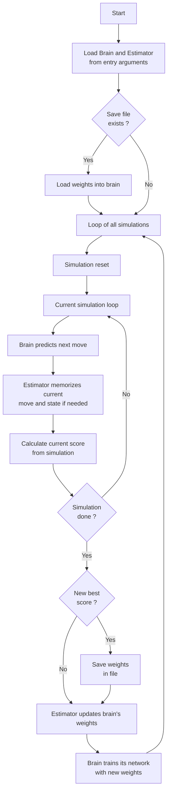

# General Information

# Usage

## Installation
```bash
pip install -r requirements.txt
```

## Run Training Session
```bash
python carRacing.py MODEL_NAME ALGORITHM_NAME
```

## Run a trained model
```bash
python visualize.py MODEL_NAME ALGORITHM_NAME
# or
python visualize.py MODEL_NAME ALGORITHM_NAME SEED # to run a specific seed
```

## View statistics
```bash
python saves/stats.py CSV_FILE
```

# Implemented Reinforcement algorithms
| Algorithm | Description | File | Applicability | Implemented ? | Responsible |
| --- | --- | --- | --- | --- | --- |
| Classic Genetic Algorithm |  |Genetic.py |✅ | ✅ | Gabriel |
| Deep Q Neural Network (DQN) |  |DQN.py |✅ |🔧 | Nathan |
| Neat Algorithm |  |  |✅ | 🚧 | Tom |
| DDPG Algorithm |  |  |✅ |🚧 | Gabriel |
| PPO Algorithm |  |  |✅ |🔴 | Hugo |
| Actor Critic Method |  |  |✅ |🔴 | Hugo |
| Q-learning or value-iteration methods |  |  |  |🔴 | |
| Q-Learning |  |  |  | 🔴 | |

> https://en.wikipedia.org/wiki/Reinforcement_learning
> https://smartlabai.medium.com/reinforcement-learning-algorithms-an-intuitive-overview-904e2dff5bbc
> https://towardsdatascience.com/introduction-to-various-reinforcement-learning-algorithms-i-q-learning-sarsa-dqn-ddpg-72a5e0cb6287
> https://medium.datadriveninvestor.com/which-reinforcement-learning-rl-algorithm-to-use-where-when-and-in-what-scenario-e3e7617fb0b1

# Implemented models
| Model | Description | File | Implemented ? | Responsible |
| --- | --- | --- | --- | --- |
| CNN |  |CNN.py |✅ | Nathan |
| Fully Connected |  |FullyConnected.py |✅ | Gabriel |
| Selective CNN |  |SelectiveCNN.py |✅ | Nathan |
| Selective Fully Connected + Kmeans | |SelectiveKMNN.py |✅ | Nathan |

# Code architecture


# Research Papers
| Algorithm | Paper |
| --- | --- |
| Deep Q Neural Network (DQN) | https://medium.com/@cyberlympha/recurrent-neural-networks-in-reinforcement-learning-11600819ede4 |
| Deep Q Neural Network (DQN) | https://openreview.net/pdf?id=r1lyTjAqYX |
| Deep Q Neural Network (DQN) | https://towardsdatascience.com/deep-q-learning-tutorial-mindqn-2a4c855abffc |
| Deep Q Neural Network (DQN) | https://storage.googleapis.com/deepmind-media/dqn/DQNNaturePaper.pdf |
| Deep Q Neural Network (DQN) | https://www.freecodecamp.org/news/an-introduction-to-deep-q-learning-lets-play-doom-54d02d8017d8 |
| Deep Q Neural Network (DQN) | https://keras.io/examples/rl/deep_q_network_breakout/ |
| Deep Q Neural Network (DQN) | https://github.com/keon/deep-q-learning/blob/master/dqn.py |
| Deep Q Neural Network (DQN) | https://huggingface.co/blog/deep-rl-dqn |
| Deep Q Neural Network (DQN) | https://huggingface.co/deep-rl-course/unit3/introduction |
| Deep Q Neural Network (DQN) | https://github.com/vwxyzjn/cleanrl/blob/master/cleanrl/dqn_atari.py |
| Deep Q Neural Network (DQN) | https://github.com/pekaalto/DQN |
